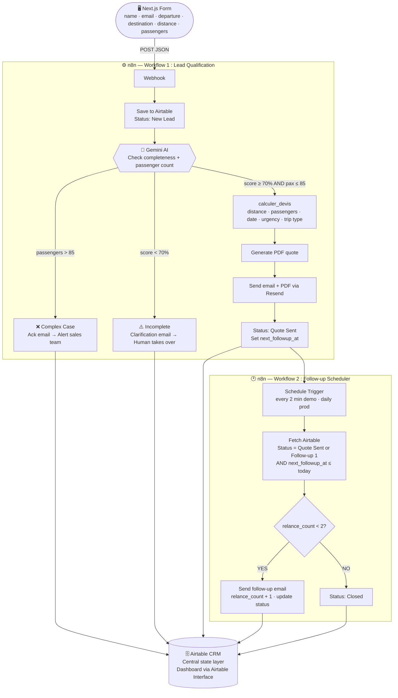

# NeoTravel — Commercial Chain Automation

> MBA1 Epitech — Group Project | July 2026
> **Team:** Gendell · Inde · Yahia

---

## What This Is

NeoTravel is a group transport intermediary (France, since 2010) that receives ~60 leads/day but processes them entirely by hand — missing leads, slow quotes, no follow-up automation.

This project automates the full commercial chain:

**Lead capture → AI qualification → Deterministic pricing → PDF quote → Email → Automated follow-ups → Dashboard**

---

## Stack

| Layer | Tool |
|---|---|
| Frontend | Next.js (React) — deployed on Vercel |
| Automation & AI orchestration | n8n (self-hosted) |
| Language model | Gemini 2.0 Flash (Google) — free tier |
| CRM & Dashboard | Airtable |
| Email delivery | Resend |

**Total cost: €0/month** — all free tiers.

---

## Architecture



### Key rule: the AI never calculates prices

All pricing goes through `calculer_devis()` — a pure deterministic function. The AI only evaluates completeness and routes leads. It never estimates or approximates a price.

---

## Pipeline Statuses

```
New Lead → Incomplete → Quote Sent → Follow-up 1 → Follow-up 2 → Closed
                                                              ↘ Complex Case
```

---

## Local Setup

### Prerequisites
- Node.js LTS — [nodejs.org](https://nodejs.org)
- n8n — `npm install n8n -g`
- Git — [git-scm.com](https://git-scm.com)

### Clone and install

```bash
git clone https://github.com/boolshyt/neotravel.git
cd neotravel
npm install
```

### Environment variables

Create a `.env.local` file at the root (never commit this):

```
RESEND_API_KEY=your_resend_key
N8N_WEBHOOK_URL=your_n8n_webhook_url
```

### Run locally

```bash
# Start n8n (keep this terminal open)
n8n start

# Start Next.js (in a separate terminal)
npm run dev
```

Open [http://localhost:3000](http://localhost:3000) for the form.
Open [http://localhost:5678](http://localhost:5678) for n8n.

### For the live demo

Expose n8n to the internet so the form can reach it:

```bash
npx ngrok http 5678
```

Copy the ngrok URL → paste it as `N8N_WEBHOOK_URL` in `.env.local`.

---

## Repository Structure

```
neotravel/
├── README.md                    # This file
├── TASKS.md                     # Task board — who does what and when
├── L1_DOSSIER_DE_CADRAGE.md     # L1 deliverable (due June 24)
├── PROJECT_GUIDE.md             # Full project reference guide
├── project/
│   ├── PRICING_ENGINE.md        # calculer_devis() spec and all pricing tables
│   └── PROJECT_RULES.md        # Rules checklist and guardrails
├── .gitignore
└── .env.local                   # API keys — local only, never committed
```

---

## Deliverables

| Date | Deliverable |
|---|---|
| June 24 at 23:59 | L1 — Dossier de cadrage |
| June 29 at 23:59 | L2 — Prototype + L3 — Handoff docs |
| June 30 at 23:59 | Presentation slides |
| July 1 | Live presentation + demo |
